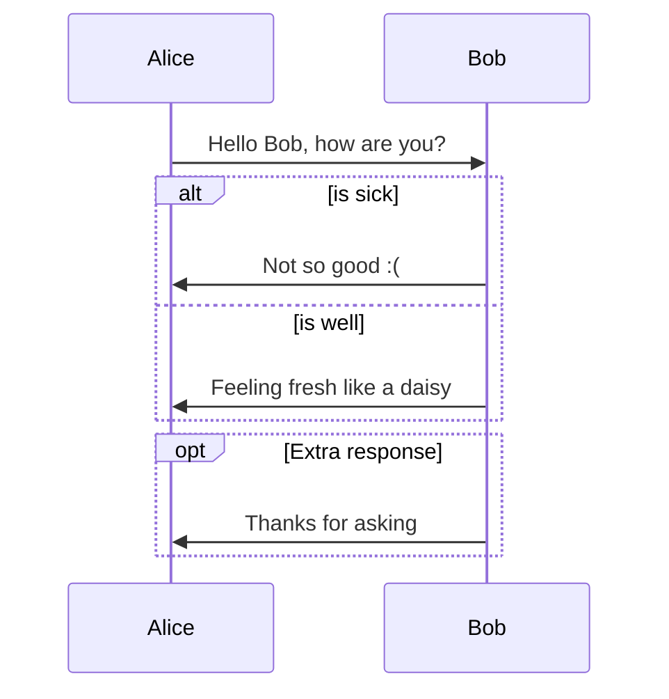
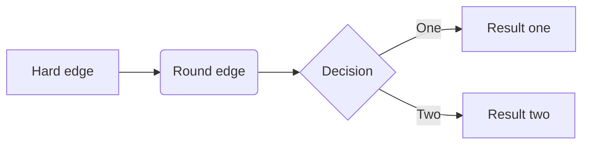
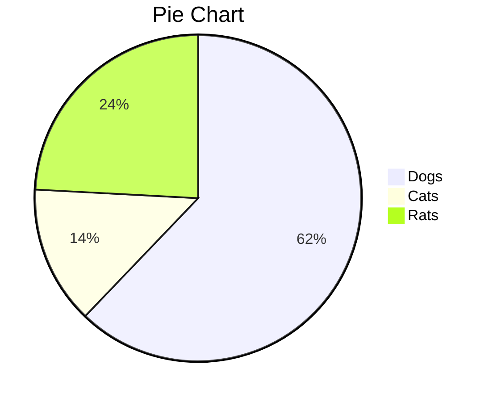

# Hello

flow cart

```flow
st=>start: Start
op=>operation: Your Operation
cond=>condition: Yes or No?
e=>end

st->op->cond
cond(yes)->e
cond(no)->op
```

Mermaid 1


Mermaid 2



Mermaid Pi



---

Here is the some code example.

```c
#include <stdio.h>

int main() {
	printf("Hello World");
	return 0;
}
```

```c++
#include <iostream>
 
int main() {
    std::cout << "Hello World";
    return 0;
}
```

```c#
namespace HelloWorld
{
    class Hello {         
        static void Main(string[] args)
        {
            System.Console.WriteLine("Hello World");
        }
    }
}
```

---

Here is some $\LaTeX$ example
$$
g_{\mu\nu} = 
\left(\begin{matrix}
g_{0,0} & g_{0,1} & g_{0,2} & g_{0,3}\\ 
g_{0,1} & g_{1,1} & g_{1,2} & g_{1,3}\\ 
g_{0,2} & g_{1,2} & g_{2,2} & g_{2,3}\\ 
g_{0,3} & g_{1,3} & g_{2,3} & g_{3,3}
\end{matrix}\right)
$$
And the fonts
$$
\begin{aligned}
&\mathbb{ABCDEFGHIJKLMNOPQRSTUVWXYZ \quad abcdefghijklmnopqrstuvwxyz}\\
&\mathcal{ABCDEFGHIJKLMNOPQRSTUVWXYZ \quad abcdefghijklmnopqrstuvwxyz}\\
&\mathrm{ABCDEFGHIJKLMNOPQRSTUVWXYZ \quad abcdefghijklmnopqrstuvwxyz}\\
&\mathbf{ABCDEFGHIJKLMNOPQRSTUVWXYZ \quad abcdefghijklmnopqrstuvwxyz}\\
&\mathit{ABCDEFGHIJKLMNOPQRSTUVWXYZ \quad abcdefghijklmnopqrstuvwxyz}\\
&\mathsf{ABCDEFGHIJKLMNOPQRSTUVWXYZ \quad abcdefghijklmnopqrstuvwxyz}\\
&\mathtt{ABCDEFGHIJKLMNOPQRSTUVWXYZ \quad abcdefghijklmnopqrstuvwxyz}\\
\end{aligned}
$$

Some inline e: $e$, $\rm e$


---

Here is a image with caption.

<figure>

<figcaption>GitHub Cat / GitHub Cat / GitHub Cat / GitHub Cat / GitHub Cat  / GitHub Cat / GitHub Cat / GitHub Cat </figcaption>
</figure>

---

Here is a Image


---

- [ ] #739
- [ ] https://github.com/octo-org/octo-repo/issues/740
- [ ] Add delight to the experience when all tasks are complete :

---

Here is the block quote.

> Lorem ipsum dolor sit amet, consectetur adipiscing elit, sed do eiusmod tempor incididunt ut labore et dolore magna aliqua. Ut enim ad minim veniam, quis nostrud exercitation ullamco laboris nisi ut aliquip ex ea commodo consequat. Duis aute irure dolor in reprehenderit in voluptate velit esse cillum dolore eu fugiat nulla pariatur. Excepteur sint occaecat cupidatat non proident, sunt in culpa qui officia deserunt mollit anim id est laborum.
> 
> > Lorem ipsum dolor sit amet, consectetur adipiscing elit, sed do eiusmod tempor incididunt ut labore et dolore magna aliqua. Ut enim ad minim veniam, quis nostrud exercitation ullamco laboris nisi ut aliquip ex ea commodo consequat. Duis aute irure dolor in reprehenderit in voluptate velit esse cillum dolore eu fugiat nulla pariatur. Excepteur sint occaecat cupidatat non proident, sunt in culpa qui officia deserunt mollit anim id est laborum.

Here is GitHub tooltip block.

> [!NOTE]
> Useful information that users should know, even when skimming content.

> [!TIP]
> Helpful advice for doing things better or more easily.

> [!IMPORTANT]
> Key information users need to know to achieve their goal.

> [!WARNING]
> Urgent info that needs immediate user attention to avoid problems.

> [!CAUTION]
> Advises about risks or negative outcomes of certain actions.

---

Here is some link 

- [GitHub](https://github.com/)
- https://github.com/

---

1. Item
    1. Item
        1. Item
            1. Item
            2. Item
        2. Item 
    2. Item
2. Item
    - Hello


- Item
    - Item
        - Item
            - Item
            - Item
        - Itemq
    - Item
- Item

# Heading 1

This is some text.

## Heading 2

This is some text.

### Heading 3 Hello

This is some text.

#### Heading 4

This is some text.

##### Heading 5

This is some text.

###### Heading 6

This is some text.

---

## Emphasis

This is text

**This is bold text**

*This is italic text*

~~Strikethrough~~

<u>This is underline</u>

---

### The standard Lorem Ipsum passage, used since the 1500s

Lorem ipsum dolor sit amet, consectetur adipiscing elit, sed do eiusmod tempor incididunt ut labore et dolore magna aliqua. Ut enim ad minim veniam, quis nostrud exercitation ullamco laboris nisi ut aliquip ex ea commodo consequat. Duis aute irure dolor in reprehenderit in voluptate velit esse cillum dolore eu fugiat nulla pariatur. Excepteur sint occaecat cupidatat non proident, sunt in culpa qui officia deserunt mollit anim id est laborum.

### Section 1.10.32 of "de Finibus Bonorum et Malorum", written by Cicero in 45 BC

"Sed ut perspiciatis unde omnis iste natus error sit voluptatem accusantium doloremque laudantium, totam rem aperiam, eaque ipsa quae ab illo inventore veritatis et quasi architecto beatae vitae dicta sunt explicabo. Nemo enim ipsam voluptatem quia voluptas sit aspernatur aut odit aut fugit, sed quia consequuntur magni dolores eos qui ratione voluptatem sequi nesciunt. Neque porro quisquam est, qui dolorem ipsum quia dolor sit amet, consectetur, adipisci velit, sed quia non numquam eius modi tempora incidunt ut labore et dolore magnam aliquam quaerat voluptatem. Ut enim ad minima veniam, quis nostrum exercitationem ullam corporis suscipit laboriosam, nisi ut aliquid ex ea commodi consequatur? Quis autem vel eum iure reprehenderit qui in ea voluptate velit esse quam nihil molestiae consequatur, vel illum qui dolorem eum fugiat quo voluptas nulla pariatur?"

### 1914 translation by H. Rackham

"But I must explain to you how all this mistaken idea of denouncing pleasure and praising pain was born and I will give you a complete account of the system, and expound the actual teachings of the great explorer of the truth, the master-builder of human happiness. No one rejects, dislikes, or avoids pleasure itself, because it is pleasure, but because those who do not know how to pursue pleasure rationally encounter consequences that are extremely painful. Nor again is there anyone who loves or pursues or desires to obtain pain of itself, because it is pain, but because occasionally circumstances occur in which toil and pain can procure him some great pleasure. To take a trivial example, which of us ever undertakes laborious physical exercise, except to obtain some advantage from it? But who has any right to find fault with a man who chooses to enjoy a pleasure that has no annoying consequences, or one who avoids a pain that produces no resultant pleasure?"


